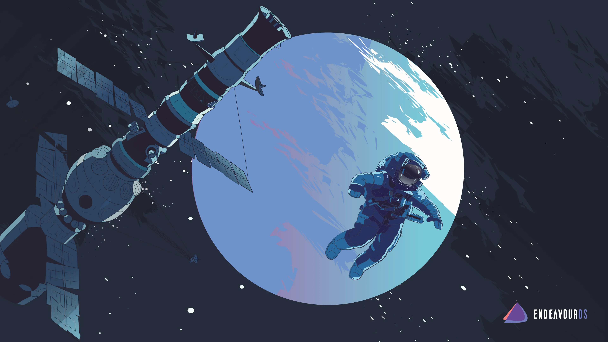

{{
}}<i>Photo from <a href=https://github.com/EndeavourOS-Community-Editions/Community-wallpapers>EndeavourOS Community Wallpapers</a></i>{{
}}

# Boost up your knowledge during the exploration of your Endeavour

This is the EndeavourOS knowledge base, the place where you can find our ever-growing wiki articles and some in-depth articles to expand your knowledge for both x86-64 and ARM-based systems.

To enhance the experience, you can also find video tutorials from the Youtube channels [Distrotube](https://www.youtube.com/channel/UCVls1GmFKf6WlTraIb_IaJg), [Chris Titus Tech](https://www.youtube.com/user/homergfunk), [Eric Adams](https://www.youtube.com/channel/UCcqoUM4UUvc9cFK-jR5Nx9A) and [EF Linux](https://www.youtube.com/channel/UCX_WM2O-X96URC5n66G-hvw) all in one place. The videos of these renowned content creators are here to add an extra layer of convenience in your search for solutions, helping to boost up your knowledge and confidence so you can persevere in the challenges your journey can bring.

So put on your jet pack to get ready for your spacewalk and enjoy the full Endeavour experience with Discovery at your side. And just remember, don’t hesitate to ask for help on our [forum](https://forum.endeavouros.com/), [Telegram](https://t.me/Endeavouros) or Reddit page if something isn’t clear for you, the community is your living and breathing lifeline, no matter how far you’ve ventured in the exploration of your Endeavour.