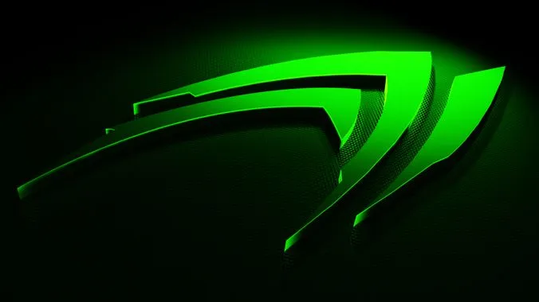
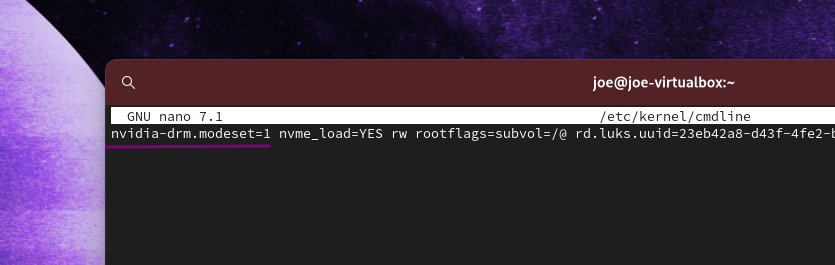

# Nvidia Optional Enchancements and Troubleshooting

It can happen that you will fail to load the Nvidia driver in some cases, such as the presence of an integrated intel GPU (build-in on Motherboard). The system can get confused and fail to properly load on the Nvidia Driver, in this case, there is a workaround to force loading Nvidia Driver in the early boot (KMS) state and forcing the loading of modules on the kernel boot option. Mainly for use on dedicated GPU-Cards (PCIe Cards on Desktop PC or Notebooks with only Nvidia GPU \[non-hybrid\] ). It can cause issues for hybrid systems ([optimus](https://discovery.endeavouros.com/nvidia/nvidia-optimus-notebooks-hybrid-graphics/2021/03/))!

*   For example: On Cinnamon you will see a message that you run in Software Rendering Mode, or the system simply boots to a black screen.. not starting X … no Login Manager starting

If you have this issue there are two ways to load the needed modules early in the boot process to have them fully initialized when reaching X. Adding it to grub kernel line or using kernel-images (Force early load \[KMS\]):

### 1\. Adding it to systemd-boot options:

`sudo nano /etc/kernel/cmdline`

**nvidia-drm.modeset=1** to the one line inside the file (adding it not replacing anything)

adding modesetting option to systemd-boot installs

and rebuild kernel images:

`sudo reinstall-kernels`

### 2\. **Adding it to grub kernel line:**

to change configuration and rebuild grub.cfg and kernel boot images :

adding **nvidia-drm.modeset=1** to the kernel parameter inside grub:

    sudo nano /etc/default/grub

and put **nvidia-drm.modeset=1** inside (leave the rest untouched!!) as you can see here:

    # GRUB boot loader configuration
    
    GRUB_DEFAULT=0 GRUB_TIMEOUT=5
    
    GRUB_DISTRIBUTOR="EndeavourOS"
    
    GRUB_CMDLINE_LINUX_DEFAULT="nvidia-drm.modeset=1 resume=UUID=...

save the file **\[Ctrl+X\]** and rebuild the grub.cfg:

    sudo grub-mkconfig -o /boot/grub/grub.cfg

### 3\. Force early load (KMS)

In most cases when you can not reach the DM (loginmanager lightdm/GDM/SDDM) it needs to force to load nvidia drivers on early boot. To do so:

**For dracut installs (deafult up from cassini release)**:

create a dropin config:

`sudo nano /etc/dracut.conf.d/nvidia.conf`

and add the following line:

add\_drivers+=” nvidia nvidia-drm nvidia-modeset nvidia-uvm ”

rebuild kernel images:

`sudo reinstall-kernels`

**for mkinitcpio usage:**

edit mkinitcpio.conf to get the module inside:

    sudo nano /etc/mkinitcpio.conf

and edit like this:

    # vim:set ft=sh
    
    # MODULES
    
    # The following modules are loaded before any boot hooks are
    
    # run. Advanced users may wish to specify all system modules
    
    # in this array. For instance:
    
    # MODULES="piix ide_disk reiserfs"
    
    MODULES="nvidia nvidia_modeset nvidia_uvm nvidia_drm"
    
    # BINARIES ....

save the file as above…

rebuild kernel image:

    sudo mkinitcpio -P

reboot again and you should have early boot enabled…

### 4\. Enhancement **avoid screen tearing**

Have nvidia-settings installed and run it on login with tagging option **FullCompositingPipeline** to get better video quality, this works for a single display setup. If you have more, you need to add them to the command or option line, for this take a look at the arch-wiki page linked here.

    nvidia-settings --assign CurrentMetaMode="nvidia-auto-select +0+0 { ForceFullCompositionPipeline = On }"

[https://wiki.archlinux.org/index.php/NVIDIA/Troubleshooting#Avoid\_screen\_tearing](https://wiki.archlinux.org/index.php/NVIDIA/Troubleshooting#Avoid_screen_tearing)

You can add this to **/etc/X11/xorg.conf.d/20-nvidia.conf** like this:

    Section "Device"
        Identifier "Nvidia Card"
        Driver "nvidia"
        VendorName "NVIDIA Corporation"
    EndSection
    
    Section "Screen"
            Identifier      "nvidia"
            Option         "metamodes" "nvidia-auto-select +0+0 { ForceFullCompositionPipeline = On }"
            Option          "TripleBuffer"                  "on"
            Option          "AllowIndirectGLXProtocol"      "off"
    EndSection
    

In some cases like using Plasma and SDDM it can be that you need to set DPI settings on multi-display setups.

The easiest way around this is to set DPI in **.Xresources** to do so:

`sudo nano ~/.Xrescources` and add DPI settings.

**`Xft.dpi:     96`**

On KDE, this can be achieved by adding the following section to `/etc/sddm.conf` (create the file if it does not exist) :

    [X11]
    ServerArguments=-nolisten tcp -dpi 96
    

**_Replace 96 by your desired DPI value._**

There is also a PKGBUILD at AUR to build a simple auto starter for full-compositing-pipeline:

[https://github.com/Askannz/nvidia-force-comp-pipeline](https://github.com/Askannz/nvidia-force-comp-pipeline)

you can build and install:

yay -S nvidia-force-comp-pipeline nvidia-settings

It will check display setup and enable it automatically using nvidia-settings on login to the session.

### 5\. Xorg issue with `framebuffer`?

System fails to load the server and give error like so:

`(EE) cannot run in framebuffer mode. Please specify busIDs for all framebuffer device.`

Check if you have unneeded drivers for Xorg installed and uninstall it:

`pacman -R xf86-video-fbdev`

It is also reported that `xf86-video-vesa` is not good to be installed in combination with Nvidia drivers.
