# Printers

To get your printer working you will mainly need to install and setup cups.

If you choose the printer support option on the installer you will already have a working cups setup and only need to add your printer.

To start with cups and an usb connected printer:

    sudo pacman -Syu cups cups-filters cups-pdf system-config-printer --needed

To get full cups with support for many different printers per default. Install this packages on top of that:

    sudo pacman -Syu ghostscript gsfonts foomatic-db-engine foomatic-db foomatic-db-ppds foomatic-db-nonfree foomatic-db-nonfree-ppds gutenprint foomatic-db-gutenprint-ppds --needed

For QT environments (like KDE/plasma LXQT):

    sudo pacman -Syu print-manager --needed

enable socket, which will listen if print-job is calling and then enable the service:

    sudo systemctl enable --now cups.socket

or using the service, which will be running constantly.

    sudo systemctl enable --now cups.service

For network printer support, check if **avahi** is installed and its daemon is running:

    systemctl status avahi-daemon

if you get an error or it shows disabled not running:

    sudo pacman -Syu avahi --needed
    sudo systemctl start avahi-daemon
    sudo systemctl enable avahi-daemon

## Automatically add network printers:

CUPS can use [Avahi](https://wiki.archlinux.org/title/Avahi) browsing to discover unknown shared printers in your network. This can be useful in large setups where the server is unknown. To use this feature, set up local hostname resolution, and start both `avahi-daemon.service` and `cups-browsed.service`. Jobs are sent directly to the printer without any processing so the created queues may not work, however driverless printers such as those supporting [IPP Everywhere](https://www.pwg.org/ipp/everywhere.html) or [AirPrint](https://en.wikipedia.org/wiki/AirPrint) should work out of the box.

This is mainly usefull for mobile devices or for usage in offices where a number of changing network printers is used.

But you can use this at home too, it can be less troublesome in case, as you do not need to setup drivers and uri.

`sudo systemctl enable --now cups-browsed.service`

And make sure mdns (local host name resolution) is enabled and added to access firewalld. see here: [https://discovery.endeavouros.com/wp-admin/post.php?post=1029&action=edit#network-printer](https://discovery.endeavouros.com/wp-admin/post.php?post=1029&action=edit#network-printer)

With this you will get network printers automatically added, without any need to setup.

## Troubleshooting:

### [Network printer not reachable](#network-printer)

It is a common issue that you can not get **wifi printers** to print, especially some **Brother wifi printers**.

It can be required to enable local hostname resolution for avahi to be able to connect to your network printer:

[https://wiki.archlinux.org/title/Avahi#Hostname\_resolution](https://wiki.archlinux.org/title/Avahi#Hostname_resolution)

Avahi provides local hostname resolution using a “_hostname_.local” naming scheme. To enable it, make sure the [nss-mdns](https://archlinux.org/packages/?name=nss-mdns) package is installed and `avahi-daemon.service` is running:

`pacman -Qs nss-mdns` to see if it is installed local:

`➜ ~ » pacman -Qs nss-mdns   local/nss-mdns 0.14.1-3   glibc plugin providing host name resolution via mDNS`

Make sure avahi-daemon is running:

`systemctl status avahi-daemon.service`

Then, edit the file `/etc/nsswitch.conf` and change the `hosts` line to include `mdns_minimal [NOTFOUND=return]` before `resolve` and `dns`:

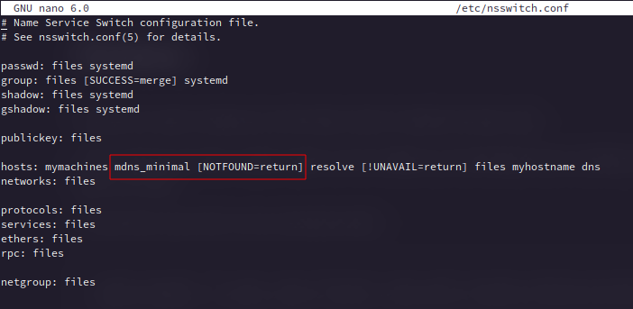

Restart avahi-daemon and NetworkManager after this, or reboot machine:

    sudo systemctl restart avahi-daemon NetworkManager

### Firewall is blocking mdns:

To make use of local hostname resolution (mdns) you need to change firewalld from **public** to **home** (zone change).

Assigning a Zone to a device will also be remembered on network changes, so if you leave home network and per example connect to a Wi-Fi network outside it will always use the default set public zone as long as you do not change that manually.

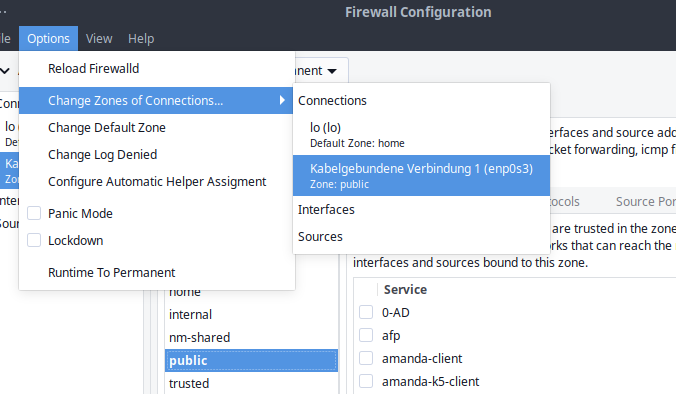
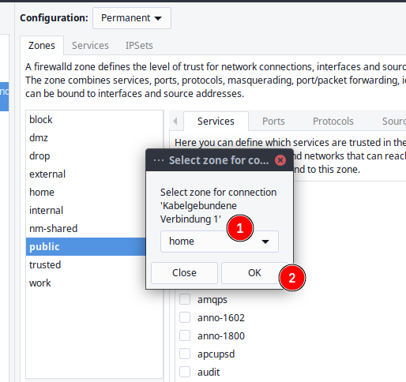
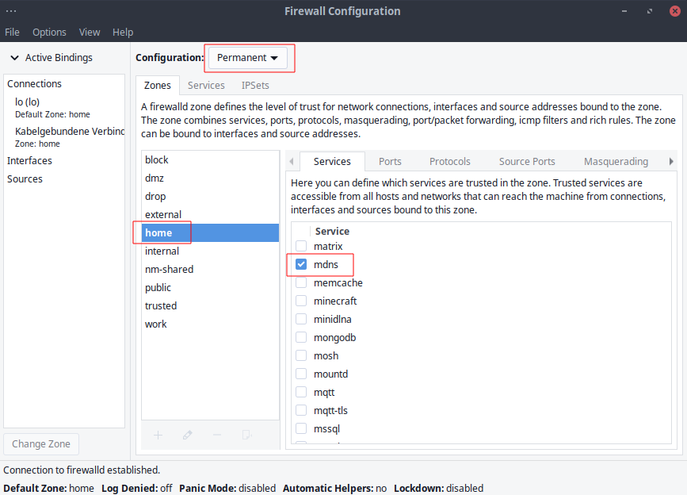

To make these permanent you need to set Configuration to **Permanent** and run the change to home zone, if **Runtime** is used it will get reset after logout. Now you should see network printers in printer setup tools showing up.

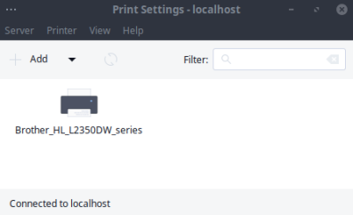
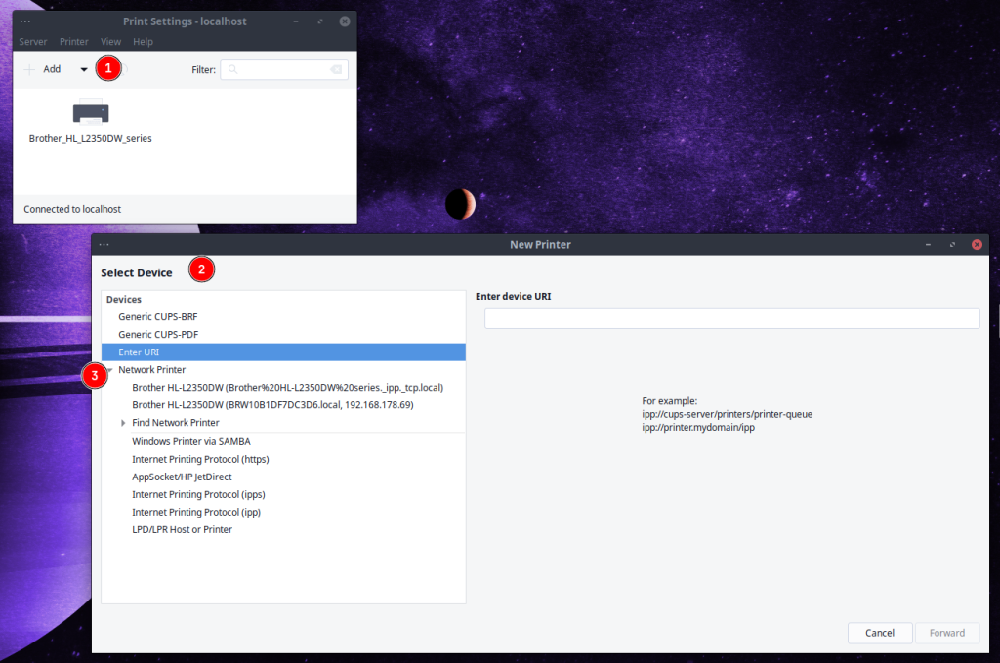

### Procedure to find the right driver for your printer:

Go to the [open printing website](https://www.openprinting.org/printers) and search for whether your printer is supported on Linux at all, and what driver options are available.

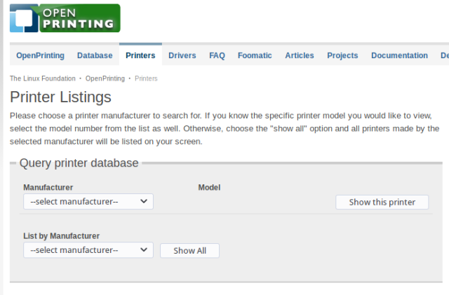

This is what the result will look like:

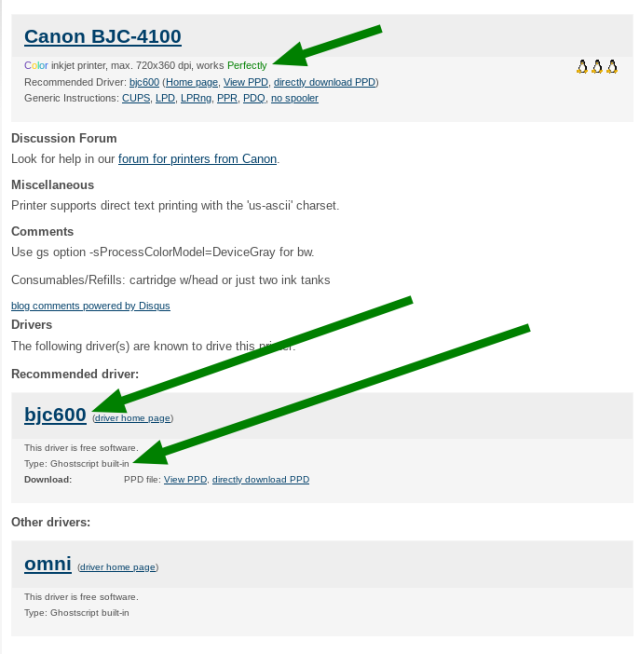

*   On top you will see whether or not there is a working driver for your printer
*   second it will show available driver options, in the example, you see **Type: Ghostscript built-in**, so go to package search on Archlinux (or use the tool of your choice) you will find [GhostScript](https://www.archlinux.org/packages/extra/x86_64/ghostscript/) (already installed if you followed the tutorial from top to bottom)

So install the driver available for your device, and proceed to install and configure the printer. But take a look at these links first, as it could be that your printer needs some extra configuration done to work properly:

### Some links to common printers’ information on Archwiki:

*   [Canon](https://wiki.archlinux.org/index.php/CUPS/Printer-specific_problems#Canon) printers
*   [Epson](https://wiki.archlinux.org/index.php/CUPS/Printer-specific_problems#Epson) printers
*   [HP](https://wiki.archlinux.org/index.php/CUPS/Printer-specific_problems#HP) printers
*   [Lexmark](https://wiki.archlinux.org/index.php/CUPS/Printer-specific_problems#Lexmark) printers
*   [Oki](https://wiki.archlinux.org/index.php/CUPS/Printer-specific_problems#Oki) printers
*   [Samsung](https://wiki.archlinux.org/index.php/CUPS/Printer-specific_problems#Samsung) printers
*   [Brother](https://wiki.archlinux.org/index.php/CUPS/Printer-specific_problems#Brother) printers

### Notes on Common ways to install printer drivers:

Mostly all printers will be using cups as a backend to communicate with your system, but different brands will be needing different ways to get printers fully functional:

### **_Hewlett_** and **_Packard_** (HP) printers:

Some of the HP-printers needs a proprietary plugin to work, this can be installed by hplip.

Here is an overview of some common printers and working drivers on Archwiki:

[Printer-specific\_problems#HP](https://wiki.archlinux.org/title/CUPS/Printer-specific_problems#HP)

Most drivers for hp-printers come with the [HPLIP package](https://www.archlinux.org/packages/extra/x86_64/hplip/) you can install this with:

`sudo pacman -S hplip`

install _python-pyqt5_ to run GUI and hp-toolbox:

`sudo pacman -S python-pyqt5`

now run the program to install new printer queue and the possibly needed proprietary plugin for some hp-printers:

`sudo hp-setup -i` for CLI install without a GUI

or run hp-setup from menu.

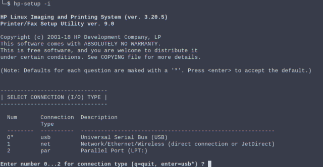

hp-setup from terminal CLI

The tool guides you through the installation – simply read the instructions.

**Current notes (29.5.2020):**

There is currently an issue with getting keys from keyservers, this also seem to effect the hp-plugin. Verify downloaded plugin to see what caused a failed to install. To solve this you need to change the server used by the tool:

`sudo nano /usr/share/hplip/base/validation.py`  
change the server to `keyserver.ubuntu.com` like this:

`def **init**(self, pgp_site = 'keyserver.ubuntu.com', key = 0x4ABA2F66DBD5A95894910E0673D770CDA59047B9):`

Save the file by pressing \[**Ctrl+X**\].

Then run `sudo hp-setup -i` again.

You have your printer added now, so you do not need to set it up again as what follows, but you can use system-config-printer to setup configuration for papersize e.t.c.

HP printers alternative driver (foo2zjs-nightly)
------------------------------------------------

Uninstall hplip package: `sudo pacman -Rsc hplip`

install [foo2zjs-nightly](https://foo2zjs.linkevich.net/) from [AUR](https://aur.archlinux.org/packages/foo2zjs-nightly/):

`yay -S foo2zjs-nightly`

Use system-config-printer to set up your HP Printer.

### Common printer setup (not if hplip is used):

Use the system-config-printer tool to find and set up your printer:

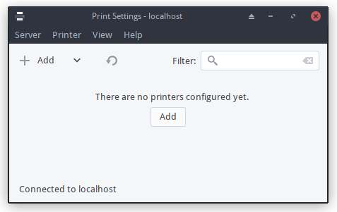

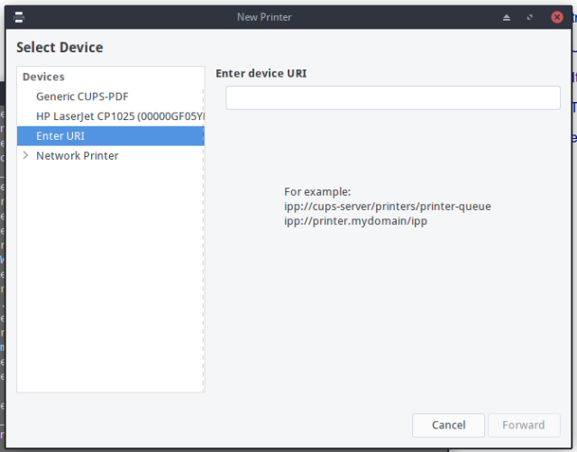

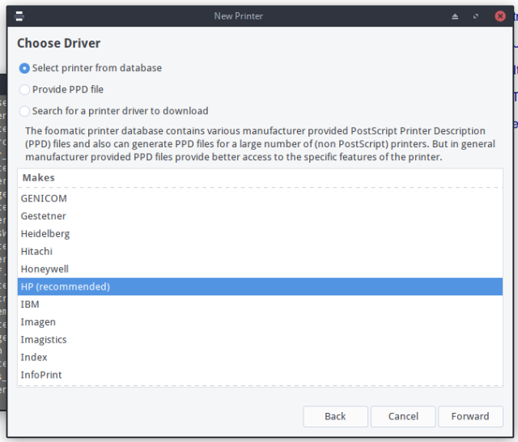

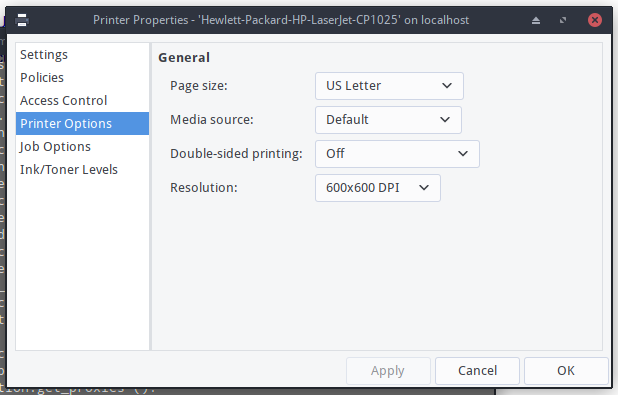

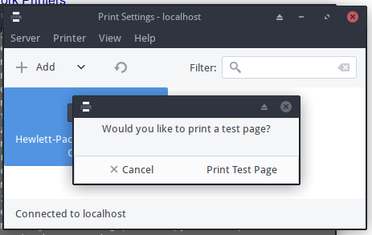

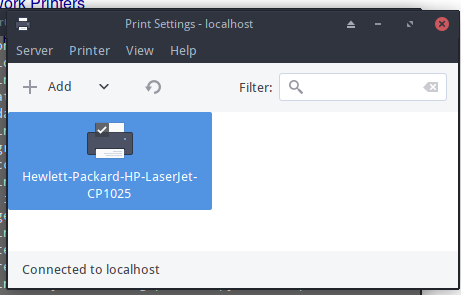

Under KDE/plasma or LXQT:

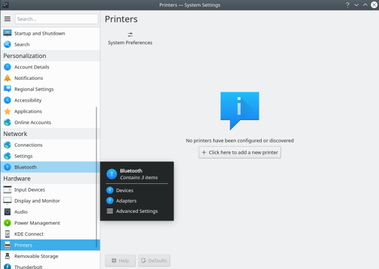

[Brother Network Printers](#brother-netwok-printer)
---------------------------------------------------

Most newer Brother Network Printers can be set up [driverless](https://openprinting.github.io/driverless/) after you enable local hostname resolution (like described up [here](https://discovery.endeavouros.com/printers/printers/2021/03/#network-printer) before).

Power on your Printer and start searching for it with system-config-printer GUI:

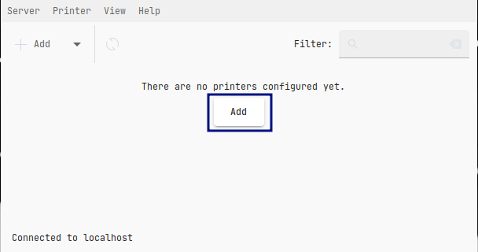

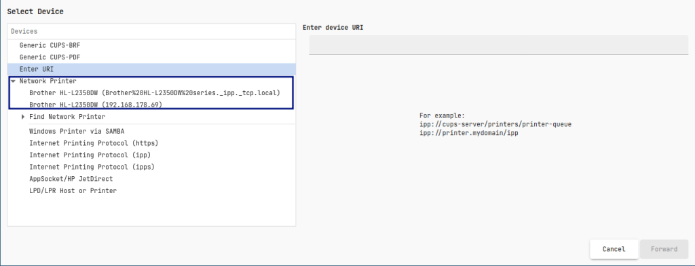

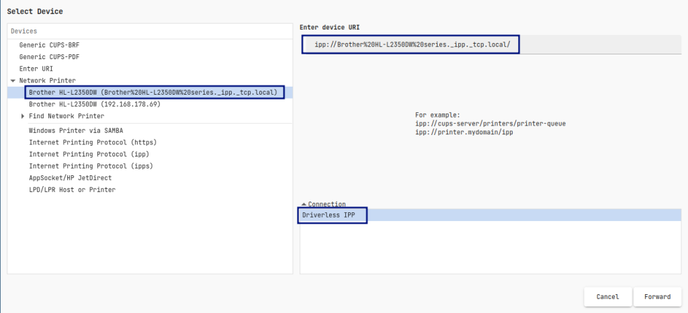

Make sure to select the entry without the URL in it, and that it shows up as Driver-Less IPP on the right side

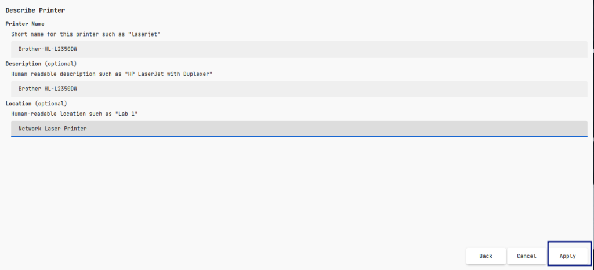

Ad a Local Name if you want

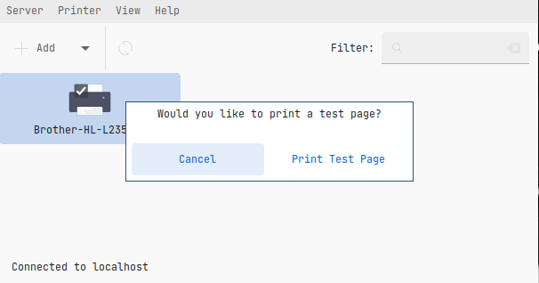

it should now give you the Option to print a test page

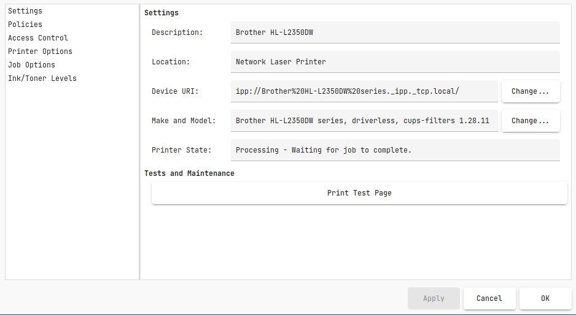

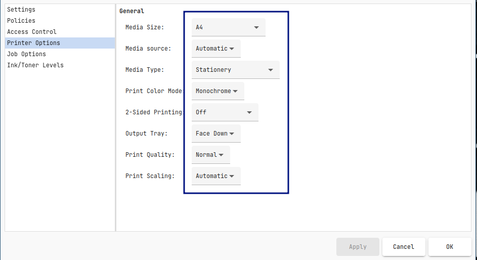

After adding the Printer make sure paper size and options are all correct.

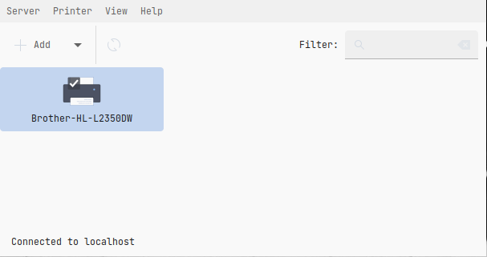
