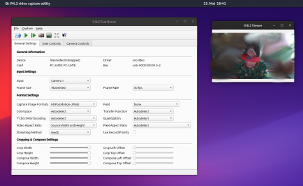
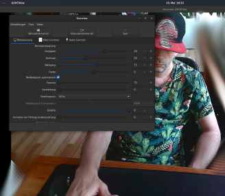

# Webcams

Setting up a webcam on Linux is easy.

In most cases, the device should be detected without any extra steps needed.

Check it:

`v4l2-ctl --list-devices`

needs [v4l-utils](https://archlinux.org/packages/extra/x86_64/v4l-utils/) installed

Per default you have at minimum two apps installed you can use to check how the webcam is working basically: **v4l2-view** ( a simple viewer) and **v4l2-test-bench** a qt-based config tool:

v4l2 test bench and viewer

In most cases setting done here will get used if you use the cam in other applications like [Jitsi](https://meet.jit.si/) or even zoom skype or other crap you have to use 😉

B.T.W if you need to use zoom Jitsi or skype… Before you go through all the hassle of installing it, try using the web app, it’s usually easier and takes less effort.

[https://meet.jit.si/](https://meet.jit.si/)

[https://www.skype.com/en/features/skype-web/](https://www.skype.com/en/features/skype-web/)

[https://web.whatsapp.com/](https://web.whatsapp.com/)

Only to show some examples…

There are a bunch of webcam clients/apps you can use on Linux on my testing a lot of them do not work properly, but I find GUVCView working smooth and without issues right out of the box.

And the app has both GTK and QT versions to choose from for installation:

`community/guvcview   Simple GTK+ interface for capturing and viewing video from v4l2 devices`

`community/guvcview-qt   Simple Qt interface for capturing and viewing video from v4l2 devices`

GUVCView gtk version

If you got any trouble or need some special setup the arch wiki will be the first read for you:

[https://wiki.archlinux.org/title/Webcam\_setup](https://wiki.archlinux.org/title/Webcam_setup)

Or if you want to follow deep into the rabbit hole:

[https://www.linuxtv.org](https://www.linuxtv.org) // [https://www.kernel.org/](https://www.kernel.org/d) // [V4L2\_camera\_overview](https://wiki.st.com/stm32mpu/wiki/V4L2_camera_overview)